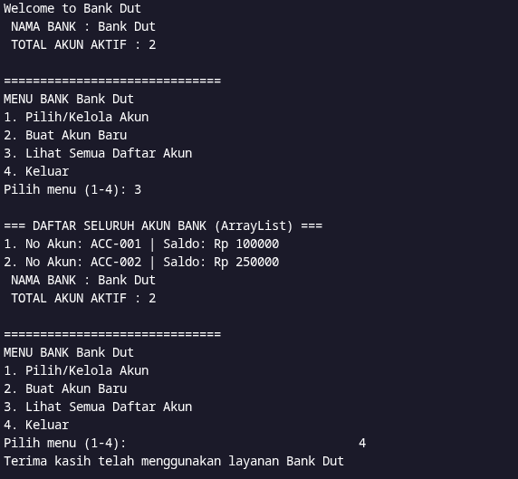
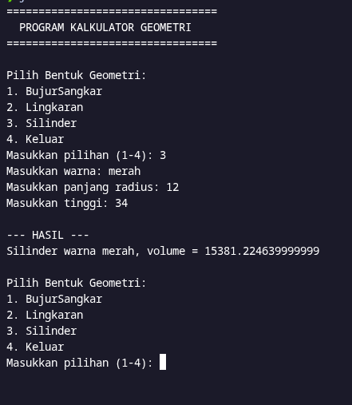

# Dokumentasi Program Java

Repositori ini berisi kumpulan program berbasis Java yang mengimplementasikan konsep Pemrograman Berorientasi Objek (PBO), yang terbagi menjadi dua program utama, yaitu Sistem Perbankan dan Kalkulator Geometri.

## 1. Program Sistem Perbankan

Program ini mensimulasikan sistem manajemen rekening bank sederhana berbasis teks. Program ini memungkinkan pengguna untuk membuat akun baru, melakukan deposit, melakukan penarikan saldo, melihat riwayat transaksi, serta menampilkan informasi umum bank.

### Penjelasan Kelas pada Sistem Perbankan:
* **Bank.java**: Kelas yang merepresentasikan entitas akun bank individual. Kelas ini mengelola atribut seperti nomor rekening, saldo, dan riwayat transaksi menggunakan struktur data array dengan batasan lima transaksi terakhir. Di dalamnya terdapat fungsi untuk melakukan `deposit` (setor tunai), `withdraw` (tarik tunai), mencetak riwayat transaksi, serta variabel statis untuk melacak total akun aktif dan nama bank.
* **BankDemo.java**: Kelas utama yang menjalankan antarmuka menu interaktif menggunakan `Scanner` dan `ArrayList`. Kelas ini menampung daftar seluruh akun yang dibuat secara dinamis dan menyediakan navigasi menu untuk memilih akun, melihat daftar seluruh akun, membuat akun baru, serta melakukan transaksi pada akun yang dipilih.

### Dokumentasi / Tangkapan Layar Program:


---

## 2. Program Kalkulator Geometri

Program ini merupakan aplikasi konsol untuk menghitung properti geometris dari berbagai bentuk bangun ruang dan datar dengan menerapkan konsep pewarisan (inheritance) dan polimorfisme.

### Penjelasan Kelas pada Kalkulator Geometri:
* **Bentuk.java**: Kelas induk (*super class*) yang mendefinisikan atribut dasar yang dimiliki oleh setiap bentuk geometri, yaitu atribut warna, lengkap dengan fungsi pengakses (`getter` dan `setter`) serta fungsi penampil informasi dasar.
* **BujurSangkar.java**: Kelas turunan (*subclass*) dari `Bentuk` yang merepresentasikan bangun datar bujur sangkar. Kelas ini menambahkan atribut sisi serta method khusus untuk menghitung luas bujur sangkar dan menimpa (*override*) fungsi cetak informasi.
* **Lingkaran.java**: Kelas turunan dari `Bentuk` yang merepresentasikan lingkaran. Kelas ini memiliki atribut radius serta konstanta nilai phi (`3.14159`) untuk menghitung luas lingkaran.
* **Silinder.java**: Kelas turunan (*multilevel inheritance*) dari kelas `Lingkaran`. Kelas ini menambahkan atribut tinggi guna menghitung volume silinder dengan mengalikan luas alas lingkaran dengan tinggi silinder.
* **Main.java**: Kelas pengendali utama yang menyajikan menu interaktif kepada pengguna untuk memilih bentuk geometri yang ingin dihitung, menerima masukan nilai dari pengguna, lalu menampilkan hasil perhitungan luas atau volume beserta warnanya.

### Dokumentasi / Tangkapan Layar Program:


---

## Cara Kompilasi dan Menjalankan Program

### Menjalankan Sistem Perbankan
```bash
javac Bank.java BankDemo.java
java BankDemo
